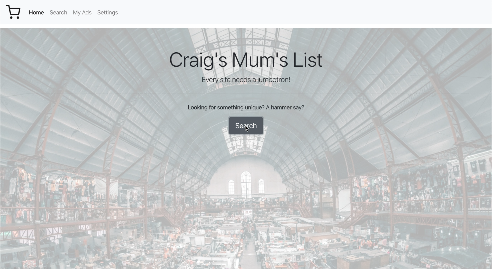

## Craigs Mums List

A full-stack RESTful web app developed as part of a team of four for posting and viewing classified ads.

Using a Java (Spring Boot, JPA and Hibernate) back-end and a JavaScript (React) front-end. Implementing derived and custom queries from the React search component that makes the fetch requests to the backend API storing ad's in a SQL database.

### The app enables the user to:

* View a list of all adverts in My Ads
* View full details of each advert
* Add a new advert
* Search for adverts 

### Software used:

* Java back-end using Spring framework
* Database: SQL with postgreSQL
* JavaScript front-end using React framework
* Insomnia used for testing the RESTful routes
* TDD with unit testing

### To run the app:

* Fork and Clone the Github repo to your local machine.
* From the command line, `cd` into the project folder and type `createdb craigs_mums_list` and press enter. 
* Open the *Server* folder using IntelliJ or another IDE then *run* the Server Application file.
* From the command line, `cd` into the *Client* folder and type `npm install` and press enter.
* Once dependencies have finished installing, type `npm start` and press enter.
* Port 3000 should open automatically in your browser displaying the web app.
